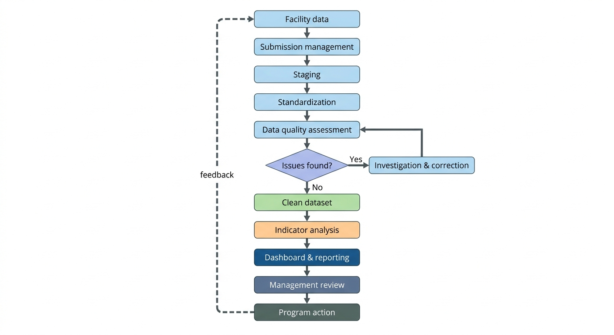
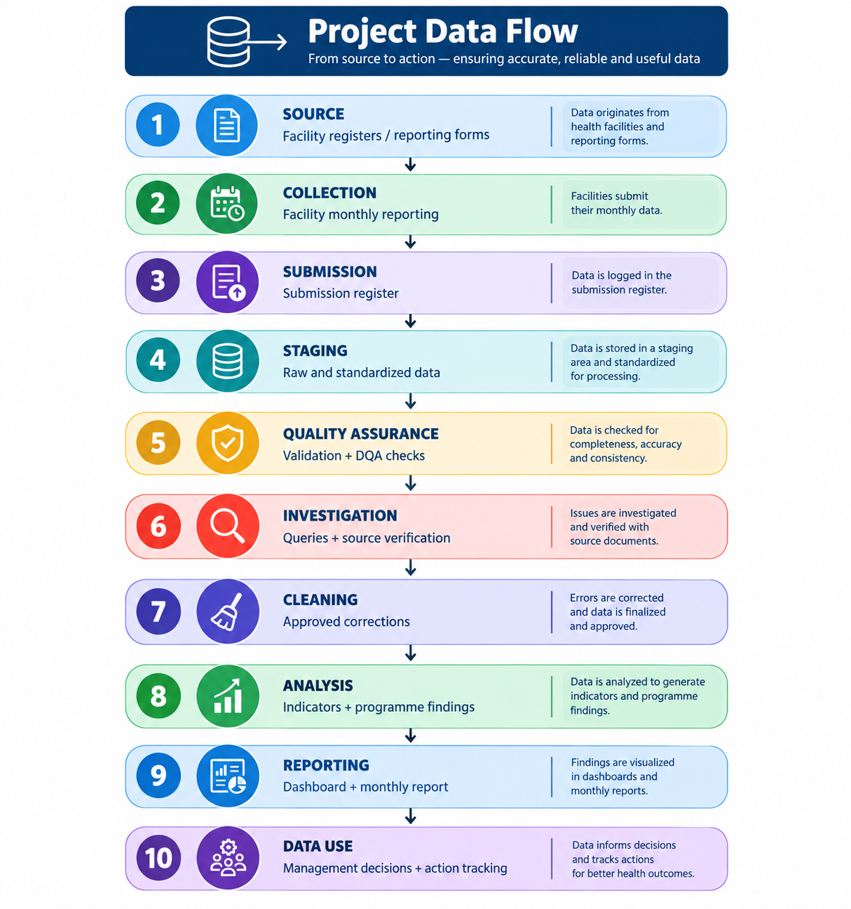
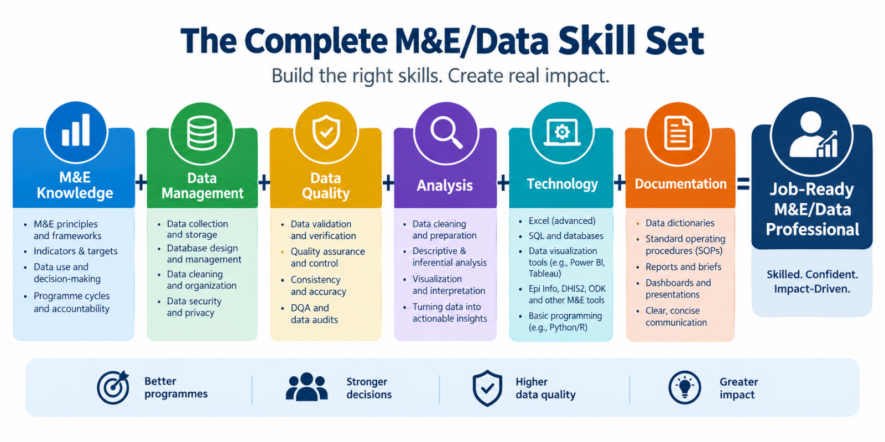

<div align="center">

# Aweil Malaria Monitoring, Evaluation & Data Quality System

### End-to-End M&E Portfolio Project

**A practical simulation of an M&E Assistant / M&E Data Officer workflow supporting malaria programming in Aweil, South Sudan.

The project demonstrates how programme data can be collected, managed, validated, quality-assured, cleaned, analysed, documented, and translated into information for programme decision-making.

Important: All data in this repository are synthetic and were created exclusively for portfolio and skills-demonstration purposes.**

</div>

---

## Project Overview

Monitoring and Evaluation work is not simply about producing tables or calculating indicators.

A functional M&E system must ensure that:

the right data are collected → submitted on time → checked for quality → cleaned and standardized → analysed → interpreted → reported → used for action.

This project simulates that complete lifecycle.

The system is designed around practical responsibilities that may be expected from an M&E Assistant, M&E Officer, Data Officer, or Data Management Officer working within a public-health programme.
### Programme Context
The simulated programme monitors malaria service delivery and reporting across health facilities in Aweil, South Sudan.

The system focuses on facility-level malaria indicators including:

Children under five attending services
Suspected malaria cases
Malaria testing
Confirmed positive cases
Treatment
Severe malaria
Malaria deaths
Reporting completeness
Reporting timeliness
Data-quality problems

The project intentionally introduces realistic data-quality problems so that the M&E workflow can demonstrate not only data analysis, but also data quality investigation and corrective action.

### Project Objective

To design and implement a practical M&E system capable of:

Collecting facility-level programme data
Managing monthly submissions
Monitoring reporting completeness
Monitoring reporting timeliness
Applying data-validation rules
Detecting data-quality problems
Investigating suspected errors
Standardizing facility and reporting-period information
Cleaning programme data
Calculating M&E indicators
Producing management-oriented analysis
Documenting data corrections and decisions
Maintaining data traceability
Supporting evidence-based programme action

## Important Disclaimer

**All data in this repository are synthetic and created exclusively for portfolio and skills-demonstration purposes.**

The project does not contain confidential beneficiary information, real patient information, or proprietary programme datasets.

The project is a simulation and should not be interpreted as evidence of employment with any organization or as analysis of real programme data.

---

## M&E System Architecture



---

### Data Quality Assurance

Data quality is a central component of the project.

The DQA framework evaluates data across the following dimensions:

Dimension	            What is assessed
Completeness	      Required data and expected facility reports
Timeliness	            Whether reports are submitted within the required period
Validity	            Whether values satisfy defined rules
Consistency	            Whether related indicators logically agree
Uniqueness	            Whether duplicate facility-period records exist
Accuracy	            Whether reported information agrees with source information where verification is possible
Traceability	      Whether transformations and decisions can be followed

### Examples of Validation Rules

Tested U5 ≤ Suspected U5

Positive U5 ≤ Tested U5

Treated U5 should be logically consistent
with confirmed malaria cases

Duplicate facility-month records
must be investigated

Missing values must not automatically
be interpreted as zero

Reporting periods must be standardized
before comparison

Facility names must be standardized
before duplicate detection

The objective is not simply to flag errors.

The objective is to establish:

Flag → Investigate → Document → Decide → Correct/Accept → Recheck

### DQA Investigation Approach

A key principle of this project is:

Do not silently fix data.

A flagged record is not automatically an error.

The investigation process is:

Raw Submission
      │
      ▼
Standardize Facility + Period
      │
      ▼
Generate Facility-Period Key
      │
      ▼
Apply DQA Rule
      │
      ▼
Flag Potential Problem
      │
      ▼
Investigate Source / Context
      │
      ▼
Document Finding
      │
      ▼
Determine Corrective Action
      │
      ▼
Re-run Validation
      │
      ▼
Quality-Assured Dataset

This provides an audit trail between the original submission and the final dataset.

Detailed methodology is documented in:

05_data_quality/dqa_methodology.md

The DQA data dictionary is documented in:

05_data_quality/dqa_data_dictionary.md

### Data Cleaning pipeline

Mission 7 focuses on converting raw programme submissions into a standardized staging dataset.

The cleaning workflow includes:

RAW DATA
   │
   ├── Preserve original values
   │
   ▼
STANDARDIZATION
   │
   ├── Facility names
   ├── Facility IDs
   ├── Reporting periods
   └── Date formats
   │
   ▼
KEY GENERATION
   │
   └── Facility-period key
   │
   ▼
DUPLICATE DETECTION
   │
   ▼
DQA VALIDATION
   │
   ▼
STAGING DATASET
   │
   ▼
QUALITY-ASSURED DATA

Power Query is used to make the transformation process repeatable and auditable.

### Data Quality Scenarios
The synthetic dataset deliberately contains realistic problems that an M&E/Data Officer would need to investigate.

Examples include:
### Facility-name inconsistencies
The same facility may appear under different spellings or formats.
The solution is to retain the original value while mapping it to a standardized facility name and facility ID.

### Reporting-period inconsistencies
Reporting periods may appear in different formats.
The cleaning process converts them into a standardized reporting-period structure.

### Duplicate facility-month records
The system creates a standardized facility-period key to identify potential duplicate submissions.

facility_period_key
=
facility_id + reporting_period_key
A duplicate flag does not automatically mean that a record should be deleted.
The duplicate must first be investigated.

### Missing programme values
Missing malaria fields are distinguished from legitimate zero values.
This prevents the system from incorrectly interpreting:
Blank ≠ Zero

### Logical indicator inconsistencies
The DQA process identifies situations where related indicators do not follow expected programme relationships.
For example:
Positive cases > Tested cases
requires investigation.

### Reporting timeliness
The system also considers whether facilities submitted their reports within the expected reporting period.

### Reporting-period mismatch
A submission may contain data belonging to a different reporting cycle.
This must be investigated rather than silently combined with the current period.

### Evidence-Based Data Quality Management
A major objective of this portfolio is to demonstrate evidence of work, not simply claim that checks were performed.

Evidence may include:

DQA screenshots
Validation outputs
Duplicate investigations
Before/after comparisons
Facility-period identifiers
Investigation findings
Corrective-action decisions
Change records
Data-cleaning transformations

### The project therefore connects:
DATA
  +
RULE
  +
FLAG
  +
INVESTIGATION
  +
EVIDENCE
  +
DECISION

This demonstrates practical data-quality management.

## Technical Stack

| Area | Tools |
| --- | --- |
| Data Collection | Excel, ODK, KoboToolbox / XLSForm |
| Data Management | Excel, Power Query |
| Data Quality | Excel, Power Query, validation rules |
| Analysis | Excel, Power Pivot, Python/Pandas |
| Database | SQL / PostgreSQL |
| Visualization | Excel dashboards, Power BI concepts |
| Reporting | Excel, Markdown, PDF |
| Application | Streamlit |
| Health Information Systems | DHIS2 |
| Documentation | Markdown, Git/GitHub |

---

## Project Missions

| Mission | Focus | Status |
| ---: | --- | --- |
| 01 | Project & M&E System Design | 🟢 Completed |
| 02 | Indicator Framework | 🟢 Completed |
| 03 | Data Collection System | 🟢 Completed |
| 04 | Data Flow & Workflow | 🟢 Completed |
| 05 | Submission Management | 🟢 Completed |
| 06 | Data Quality Assessment | 🟢 Completed |
| 07 | Data Cleaning Pipeline | 🟡 In Progress |
| 08 | DQA Investigation & Change Control | ⚪ Planned |
| 09 | Monthly M&E Analysis | ⚪ Planned |
| 10 | Dashboard | ⚪ Planned |
| 11 | Monthly M&E Report | ⚪ Planned |
| 12 | Management Review | ⚪ Planned |
| 13 | Field Monitoring | ⚪ Planned |
| 14 | ODK/Kobo | ⚪ Planned |
| 15 | SQL M&E Database | ⚪ Planned |
| 16 | Python Automation | ⚪ Planned |
| 17 | DHIS2 | ⚪ Planned |
| 18 | Streamlit M&E Application | ⚪ Planned |
| 19 | Data Governance | ⚪ Planned |
| 20 | Full M&E Assistant Simulation | ⚪ Planned |

---

## Key M&E Capabilities Demonstrated

### M&E System Design

- Results frameworks
- Indicator definitions
- Data sources
- Reporting responsibilities
- Data-flow design

### Data Management

- Facility master data
- Submission tracking
- Data standardization
- Staging and clean datasets
- Data traceability

### Data Quality Assurance

- Completeness
- Timeliness
- Validity
- Consistency
- Uniqueness
- Accuracy
- Traceability
- DQA investigation
- Corrective action tracking

### Data Analysis

- Indicator calculation
- Coverage and performance analysis
- Trend analysis
- Programme interpretation
- Management-oriented findings

### Technical Skills

- Excel
- Power Query
- Power Pivot
- Python/Pandas
- SQL
- ODK/Kobo/XLSForm
- DHIS2
- Streamlit
- Git/GitHub

---

## Project Data Flow

The project follows a controlled data lifecycle:



---

## Repository Structure

```text
01_project_design/
Project overview
Results framework
Indicator reference sheet
Assumptions
02_data_collection/
Facility reporting form
Data dictionary
Validation rules
03_data_flow/
Data-flow workflow
Workflow diagram
Data-management SOP
04_submission_management/
Submission tracker
Submission register
05_data_quality/
DQA framework
DQA rules
DQA flags
Investigation log
Change log
06_data_cleaning/
Raw data
Staging data
Clean data
Power Query transformations
07_analysis/
Indicator calculations
Analysis
Findings
08_dashboard/
Dashboard
Screenshots
09_reporting/
Monthly M&E report
Management summary
10_field_monitoring/
Supervision checklist
Field visit report
Action plan
11_odk_kobo/
XLSForms
Forms
Documentation
12_sql/
Database schema
DQA queries
Analysis queries
13_python/
Data cleaning
DQA automation
Analysis
14_dhis2/
DHIS2 implementation documentation
15_streamlit/
M&E application
docs/
Architecture
Data dictionary
Project journal
```

---

## Complete M&E/Data Skill Set



---
## DQA_quality_flow_evidence_diagram

---
## DQA_validation_results


---
## duplicates

---
## M&E DQA summary

---


## Current Project Status

The project is being developed mission-by-mission.

Each mission documents:

The programme problem
M&E requirements
Data structure
Technical implementation
Data-quality controls
Investigation and decision-making
Outputs produced
Lessons learned
This approach demonstrates not only the ability to manipulate data, but also the ability to design, manage, quality-assure, analyse, document, and use M&E information for programme decision-making.

This approach demonstrates not only the ability to manipulate data, but also the ability to **design, manage, quality-assure, analyse, document, and use M&E information for programme decision-making.**

---

## Portfolio Goal

The final product will demonstrate an end-to-end M&E capability rather than isolated software skills.

```text
M&E Knowledge
      +
Data Management
      +
Data Quality
      +
Analysis
      +
Technology
      +
Documentation
      =
Job-Ready M&E/Data Professional
```

---

<div align="center">

**End-to-end M&E thinking • Data quality • Data management • Analysis • Data use**

</div>
